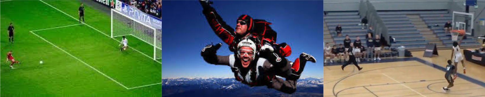
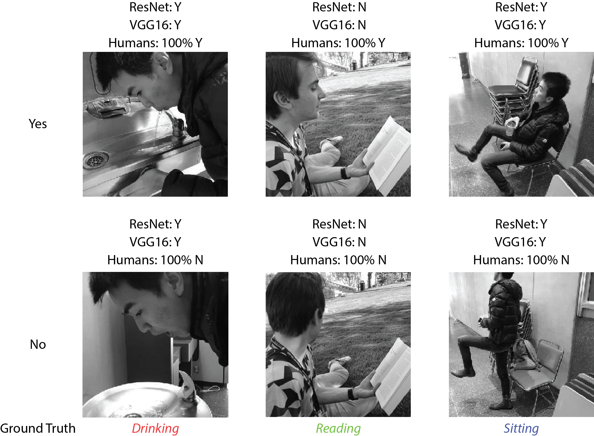
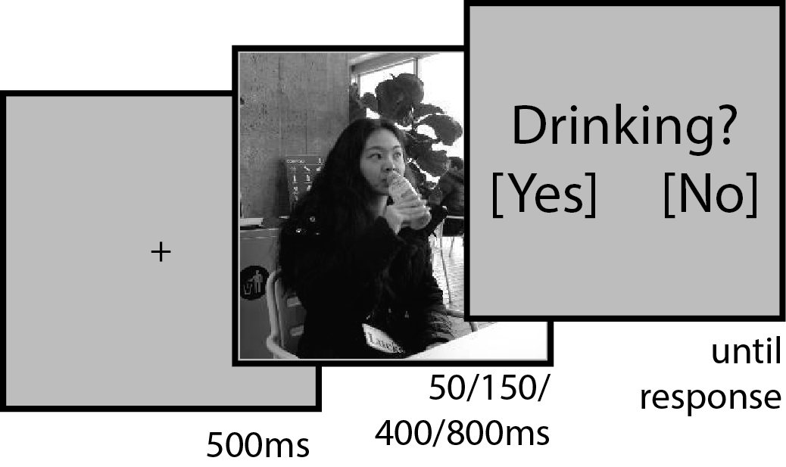

This repository contains the code and images used for the publication ["Can Deep Learning Recognize Subtle Human Activities?"](https://arxiv.org/abs/2003.13852).

<b> Summary</b>

Our work builds on the observation that image datasets used in machine learning contain many biases. Those biases help convolutional neural networks to classify images. For example, in the UCF101 dataset, algorithms can rely on the background color to classify human activities. 

  

To address this issue, we followed a rigorous method to build three image datasets corresponding to three human behaviors: drinking, reading, and sitting. Here are some example images from our dataset. The models misclassified the bottom left, middle top,   and bottom right pictures, whereas humans correctly classified all six pictures.

  

We reduced biases in our image datasets by applying 100 to 300 cross-validations of a fine-tuned deep convolutional network ([computer-vision/keras/misclassification\_rate](https://github.com/jqvincent/DeepLearning-vs-HighLevelVision/tree/master/computer-vision/keras) and [computer-vision/matlab/alexnet_misclass_rate.m](https://github.com/jqvincent/DeepLearning-vs-HighLevelVision/blob/master/computer-vision/matlab/alexnet_misclass_rate.m)). The many cross-validations allow to rank images along their misclassification rate. We then excluded images that were classified too easily. Thus, we obtained datasets that were less biased, more difficult to classify by algorithms. 

The ground truth labels for each image was created by asking 3 participants to assign each image to a <i>yes</i> or <i>no</i> class for each action. We also conducted a separate psychophysics experiment ([human-vision](https://github.com/jqvincent/DeepLearning-vs-HighLevelVision/tree/master/human-vision))

  
  
Images were presented to human participants; each trial consisted of fixation (500 ms),   image presentation (50, 150, 400, or 800 ms), and a forced choice yes/no question.

