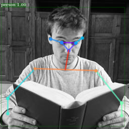
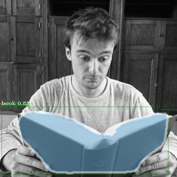

Follow [Detectron/INSTALL.md](https://github.com/facebookresearch/Detectron/blob/master/INSTALL.md) to set up the environment. 
The scripts are run similarly to `tools/infer_simple.py` as described in [Detectron/GETTING\_STARTED.md ](https://github.com/facebookresearch/Detectron/blob/master/GETTING_STARTED.md).

- `im_detect_features.py` returns the features of the region proposals from any category, like `detectron/core/test.py`. It is used in all three activities, <em> drinking</em>, <em> reading</em> or <em> sitting</em>.

- `vis_extract_X.py` returns features, bounding box and keypoints from the category of interest. It works in pair with `infer_simple_extract_X.py`, where X replaces `human`, `reading` or `drinking` respectively. 

- classify\_features

#### Extracting the person in the picture

We use the model giving best performance on the COCO dataset keypoints challenge, according to detectron's [model zoo](https://github.com/facebookresearch/Detectron/blob/master/MODEL_ZOO.md). Here, the selected model is `e2e_keypoint_rcnn_X-101-32x8d-FPN_s1x.yaml`.

```
python tools/infer_simple_extract_human.py \
	--cfg configs/12_2017_baselines/e2e_keypoint_rcnn_X-101-32x8d-FPN_s1x.yaml \
	--output-dir demo/output/reading_gray/train/yes/ \
	--image-ext jpg \
	--wts https://dl.fbaipublicfiles.com/detectron/37732318/12_2017_baselines/e2e_keypoint_rcnn_X-101-32x8d-FPN_s1x.yaml.16_55_09.Lx8H5JVu/output/train/keypoints_coco_2014_train%3Akeypoints_coco_2014_valminusminival/generalized_rcnn/model_final.pkl \
	--thresh 0.4 \
	--kp-thresh 1.3 \
	demo/reading_gray/train/yes/ 
```

The model is applied to all <em> .jpg</em> images in the `demo/reading_gray/train/yes/` directory. The keypoints, bounding box and features of the main person on the image are saved into <em> .pkl</em> files. The main person corresponds to the largest bounding box, among the boxes with a score in the person category that is higher than some threshold (set by --thresh).

<div align="center">
  
  <p>Example output showing the person's keypoints.</p>
</div>

#### Extracting the reading material in the picture

```
python tools/infer_simple_extract_reading.py 
	--cfg configs/12_2017_baselines/e2e_mask_rcnn_X-101-64x4d-FPN_1x.yaml \
	--output-dir demo/output/reading_rgb/train/yes/ \
	--image-ext jpg \
	--wts https://dl.fbaipublicfiles.com/detectron/36494496/12_2017_baselines/e2e_mask_rcnn_X-101-64x4d-FPN_1x.yaml.07_50_11.fkwVtEvg/output/train/coco_2014_train%3Acoco_2014_valminusminival/generalized_rcnn/model_final.pkl \
	--thresh 0.2 \
	demo/reading_rgb/train/yes/ 
```

The same model (e2e_mask_rcnn_X-101-64x4d-FPN_1x.yaml) is used both for the main reading material in the  <em>reading</em> activity and main the beverage in the <em>drinking</em> activity.
"Main" refers to the largest bounding box, among the boxes with a score that is higher than some threshold (set by --thresh) in the COCO categories of interest.
Hence, the usage for `tools/infer_simple_extract_drinking.py` is similar to `tools/infer_simple_extract_reading.py` described above.


`vis_extract_human.py`, `vis_extract_reading.py` and `vis_extract_drinking.py` are all the same scripts, originating from `/utils/vis.py`, except that they return keypoints, bounding box and features for a person, a reading material (book, cell phone, laptop, TV) or a beverage (cup, wine glass, bottle), respectively.


<div align="center">
  
  <p>Example output showing segmentation of the book in the picture.</p>
</div>
